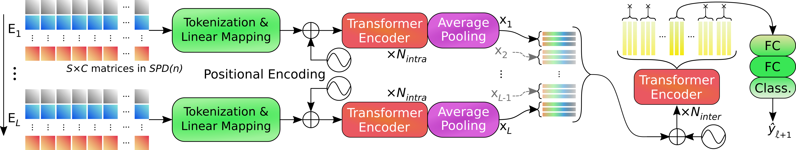

<h1 style="text-align: center;">SPDTransNet - A Transformer-based structure-preserving model for the analysis of Symmetric Positive Definite matrices</h1>

This repository is the official implementation of the SPDTransNet model, as presented in the paper
***Structure-Preserving Transformers for Sequences of SPD Matrices***
by [Mathieu Seraphim](https://orcid.org/0000-0002-9367-1190), [Alexis Lechervy](https://orcid.org/0000-0002-9441-0187),
[Florian Yger](https://orcid.org/0000-0002-7182-8062), [Luc Brun](https://orcid.org/0000-0002-1658-0527)
and [Olivier Etard](https://orcid.org/0000-0003-3661-0233) - submitted to ICASSP 2024 (acceptance pending - Preprint
[here](https://arxiv.org/pdf/2309.07579.pdf)).

A previous, non-structure-preserving version of this method was presented in the paper
***Temporal Sequences of EEG Covariance Matrices for Automated Sleep Stage Scoring with Attention Mechanisms***
by [Mathieu Seraphim](https://orcid.org/0000-0002-9367-1190), [Paul Dequidt](https://orcid.org/0000-0002-8362-7735),
[Alexis Lechervy](https://orcid.org/0000-0002-9441-0187), [Florian Yger](https://orcid.org/0000-0002-7182-8062),
[Luc Brun](https://orcid.org/0000-0002-1658-0527) and [Olivier Etard](https://orcid.org/0000-0003-3661-0233) - 
Conference CAIP 2023, Cyprus (in press - Accepted Manuscript [here](https://lechervy.users.greyc.fr/publi/C/publi_pdf/caip23.pdf)).  
Other references can be found in this repository's main paper.

**Important:** due to space constraints, some specifics were left out of the paper. To selectively read the relevant
sections, please prioritize sections [marked with an asterisk](#documentation), as well as the similarly marked
subsections within them.  
A spreadsheet with our model's results (as summarized in the paper) can be found [here](./_z_miscellaneous/documentation/extras/ICASSP%20runs.xlsx).

For additional information, feel free to [contact us](mailto:mathieu.seraphim@unicaen.fr).

<h2 style="text-align: center;">Brief overview</h2>

[The SPDTransNet model](./_4_models/_4_1_sequence_based_models/VectorizedSPDFromEEGSuccessiveChannelsTransformerModel.py)
(see figure above) is designed to adapt [Transformers](https://proceedings.neurips.cc/paper_files/paper/2017/file/3f5ee243547dee91fbd053c1c4a845aa-Paper.pdf)
to analyze timeseries of Symmetric Positive Definite (SPD) matrices.  
More specifically, it takes as input a sequence of elements, and outputs a classification only for the central element of
the sequence (the surrounding elements providing contextual information).
Each element described as a (potentially multichannel) sequence of SPD matrices (as seen in the figure),
[bijectively tokenized](./_z_miscellaneous/documentation/2%20-%20From%20Signals%20To%20SPD%20Matrices%20To%20Tokens.md#tokenization)
to be processed by the model.

A first intra-element step extracting element-wise features, and a second inter-element step to compare said features.
Both steps are based on Transformer encoders, utilizing our SP-MHA auto-attention mechanism described below.

<h3 id="test" style="text-align: center;">Structure-Preserving Multihead Attention (SP-MHA)</h3>

[The SP-MHA bloc](./_4_models/_4_1_sequence_based_models/intra_element_block/Transformer_based_feature_extraction/layers/StructurePreservingMultiheadAttention.py)
generates $h$ attention maps from projected tokens in the same way as the original Linear MHA, bui it then combines them
and applies them to the unaltered tokens (i.e. 1D vectors) in the V(alue) tensor.

The tokens in V only undergo linear combinations weighted by the attention maps, without linear mappings or concatenations.
Hence, this auto-attention mechanism does not alter the geometric properties of the inputs, as long as:
- Said inputs may be described in vector form without loss of structural information,
- Linear combinations between these tokens do not cause a loss of structural information.

Both of these are true for our tokenized SPD matrices (cf. paper).

<h3 style="text-align: center;">Application to EEG Sleep Staging</h3>

EEG sleep staging refers to the subdivision of a set of concurrent 1D electrophysiological signals (including EEG) into
fixed-length windows called "epochs", which are manually labeled ("scored") with a given sleep stage.  
Theoretical justifications for this approach can be found in the paper.

In this repository, we use the data from the [Montreal Archive of Sleep Studies](http://ceams-carsm.ca/en/mass/)' SS3 dataset (MASS-SS3),
comprised of 62 healthy subjects and scored using the AASM scoring rules, with 30s epochs and 5 sleep stages: Awake,
REM sleep, and the N1, N2 and N3 non-REM sleep stages.

Each epoch is subdivided into 30 1s segments, to capture relevant events of around 1 to 2 seconds in duration.
As these events also exhibit distinctive frequential characteristics, we filter the signals to isolate frequency bands.

Our default preprocessing strategy uses 8 EEG signals and 6 distinct frequency bands - giving us, for each epoch,
a timeseries of $S$ = 30 SPD matrices of size 9 $\times$ 9 over $C$ = 7 channels 
[after preprocessing](./_z_miscellaneous/documentation/2%20-%20From%20Signals%20To%20SPD%20Matrices%20To%20Tokens.md)
(cf. figure).

<h3 id="caveats" style="text-align: center;">A few caveats</h3>

In this repository, the term "epoch" may be used in two contexts:
- In reference to the model, it corresponds to a training cycle (standard Deep Learning nomenclature).
- In reference to the data, it corresponds to a period of 30s in the input signal, and the features describing it (standard sleep medicine nomenclature).

This implementation has been build with modularity in mind. However, the approach taken is fairly  nonstandard:
- Folders are organized starting with an underscore, to keep them in a sorted order - this goes against Python coding conventions (marking them as "protected"), but doesn't impact computations,
- The way classes are instantiated from YAML files (the "Wrapper" classes) is a complete workaround to how the utilized functions were supposed to work.

Consequently, the code remains modular and adaptable, but might be challenging to reuse in another context.

<h2 style="text-align: center;">Instructions</h2>

The following instructions should be sufficient to reproduce the results presented in the paper. To expand upon it,
see the [further documentation](#documentation) linked below.  
Please note that [the MASS dataset](http://ceams-carsm.ca/en/mass/) is only available upon demand.

This repository was built for mono-GPU usage on a remote server managed using SLURM. Examples of execution scripts can
be found [here](./_6_bash_scripts), and need to be adapted to suit your situation.  
Keep in mind that the folder to store SLURM output and error files must most likely be manually created prior to running
the SLURM scripts.  
All Python scripts should be run from the repository's root, or you risk breaking imports. The execution scripts linked
above can be run from anywhere.

<h3 style="text-align: center;">Python environment</h3>

This repository has been tested with Python versions 3.8.10 and 3.9.12, with the full list of used libraries available
[here](./_z_miscellaneous/documentation/tested_environments).  
Compatibility with other versions of the presented libraries is not guaranteed.

**IMPORTANT:** this repository does **not** currently work with versions 2.x and above of PyTorch or PyTorch Lightning!

<h3 style="text-align: center;">Preprocessing</h3>

1. Move the MASS SS3 dataset folder into the `_2_1_original_datasets` [directory](./_2_data_preprocessing/_2_1_original_datasets).
It should be named `MASS_SS3`, and contain all `* Base.edf` and `* PSG.edf` files for all 62 subjects - numbered from
`01-03-0001` to `01-03-0064`. Subjects 43 and 49 should be missing; that is normal.
2. Directly run the `MASS_extraction.py` [Python script](./_2_data_preprocessing/_2_2_data_extraction/_extraction_scripts/MASS_extraction.py),
 or [the corresponding SLURM script](./_6_bash_scripts/_6_2_slurm_execution/slurm_run_extraction_MASS_SS3.sl). This 
should generate the `MASS_SS3_extracted` [folder](./_2_data_preprocessing/_2_2_data_extraction/MASS_SS3_extracted)
in the appropriate [location](./_2_data_preprocessing/_2_2_data_extraction), containing 62 `.pkl` files.
3. Directly run the `SPDFromEEGPreprocessor.py` [Python script](./_2_data_preprocessing/_2_3_preprocessors/SPD_matrices_from_EEG_signals/SPDFromEEGPreprocessor.py),
 or [the corresponding SLURM script](./_6_bash_scripts/_6_2_slurm_execution/slurm_run_preprocessing_MASS_SS3.sl). This
should generate the `_2_4_preprocessed_data` directory (if it doesn't exist), as well as the `MASS_SS3_dataset_with_ICASSP_signals_config`
[folder](./_2_data_preprocessing/_2_4_preprocessed_data/MASS_SS3_dataset_with_ICASSP_signals_config) folder therein.
This folder contains a `.pkl` file for every epoch in the dataset (> 58000).

<h3 style="text-align: center;">Reproducing our results</h3>

1. Run the model for training using [the appropriate BASH script](./_6_bash_scripts/_6_1_local_execution/bash_one_run_full_spd_best_mf1_length_21.sh)
31 times sequentially, e.g. through the command `bash bash_one_run_full_spd_best_mf1_length_21.sh [X]`,
substituting `X` with every integer from 0 to 30; or run
[the corresponding SLURM script](./_6_bash_scripts/_6_2_slurm_execution/slurm_all_folds_full_spd_best_mf1_length_21.sl)
once. This should generate the `lightning_logs` [folder](./lightning_logs) at the project root, as well as a log folder
within called  `version_[X]`. This will also create a folder called `tmp_vectorized_data` (if it doesn't already exist),
as well as `.zip` files that will be automatically deleted if the run terminates without error.
2. When all training runs have ended, the `tmp_vectorized_data` [folder](./tmp_vectorized_data) may be safely deleted.
3. Directly run the `command_line_tester.py` [Python script](./command_line_tester.py), or
[the corresponding SLURM script](./_6_bash_scripts/_6_2_slurm_execution/slurm_runs_analysis.sl).
4. This should generate the `test_logs` folder at the project root, which may safely be deleted after the program ends.
Same thing for `tmp_vectorized_data`, which should be re-generated as before.
5. The `output` [folder](./_5_execution/_5_1_runs_analysis/output) should be generated within the `5_1_runs_analysis`
[directory](./_5_execution/_5_1_runs_analysis). It should contain the `runs_analysis.csv` file, containing the computed
metrics on all folds and corresponding hyperparameters, as well as the `confusion_matrices` folder, containing `.png`
images of confusion matrices on the test set. To prevent any overrides, be sure to rename or move these elements before
re-attempting step 3.

**IMPORTANT:** do **not** run the model training on a fold for which a folder exists in `lightning_logs`, as this will
combine both logs and lead to issues down the line. If you want to keep both log folders, rename the first one or remove
it from `lightning_logs`.

<h3 style="text-align: center;">From hyperparameter research to final results</h3>

This is similar to the above instructions, with the following changes:
- Before step 1, generate the `[ROOT]/db/database.db` [file](./db/database.db) necessary for the hyperparameter research
by running the appropriate BASH script (for [local execution](./_6_bash_scripts/bash_optuna_db_generation_local.sh)
or on a [SLURM server](./_6_bash_scripts/bash_optuna_db_generation_server.sh)).
- In step 1, run [the hyperparameter research SLURM script](./_6_bash_scripts/_6_2_slurm_execution/slurm_hparam_research_full_spd_length_21.sl),
or a local equivalent (not provided here). This should run a total of 50 runs oo fold 11, with a maximum of 5 running at
any moment.
- Once the search is finished, substitute contents of the current
[hyperparameters configuration file](./_1_configs/_1_z_miscellaneous/execution/past_runs_hyperparameters/prevectorized_spd_network_length_21_best_mf1_hparams.yaml)
with the contents of the file `[ROOT]/lightning_logs/version_[X}/hparams.yaml`, with `[X]` the index of the run yielding
the highest validation MF1, as seen in `runs_analysis.csv`. Be sure to set the hyperparameter `save_in_single_file` to
`true`.
- Repeat the steps of the section above.

**IMPORTANT:** unlike in the above section, temporary data is stored in separate files within the `tmp_vectorized_data`
folder during hyperparameter research, as opposed to a single `.zip` files. This is way faster, but generates large
amounts of files (more than 50000 per simultaneous run). This behavior is controlled by the `save_in_single_file`
hyperparameter mentioned above.  
As files systems usually have a limit to the amount of files allowed to exist at one given time, this behavior can be
a limiting factor in terms of amount of simultaneous runs possible.

<h2 id="documentation" style="text-align: center;">Further Documentation*</h2>

To further understand our approach and/or expand upon it, please refer to the following documentation files:
- [Implemented Configuration Strategy](./_z_miscellaneous/documentation/1%20-%20Implemented%20Configuration%20Strategy.md) -
an overview of our configuration files, and how to make your own.
- [From Signals To SPD Matrices To Tokens](./_z_miscellaneous/documentation/2%20-%20From%20Signals%20To%20SPD%20Matrices%20To%20Tokens.md)* -
the various steps underwent to transform our data from 1D signals to multichannel sequences of SPD matrices.
- [Formatting The Model Inputs](./_z_miscellaneous/documentation/3%20-%20Formatting%20The%20Model%20Inputs.md) -
data rebalancing and trimming, batch formation and temporary storage strategies.
- [The SPDTransNet Model](./_z_miscellaneous/documentation/4%20-%20The%20SPDTransNet%20Model.md) -
the modular implementation of the model's various components.
- [Running The Model](./_z_miscellaneous/documentation/5%20-%20Running%20The%20Model.md) -
instructions on execution customization and hyperparameter researches.

<h2 style="text-align: center;">Acknowledgements</h2>

The first author is supported by the French National Research Agency (ANR) and Region Normandie under grant HAISCoDe.  
This work was granted access to the HPC resources of IDRIS under the allocation 2022-AD010613618 made by GENCI, and
to the computing resources of CRIANN (Normandy, France).

