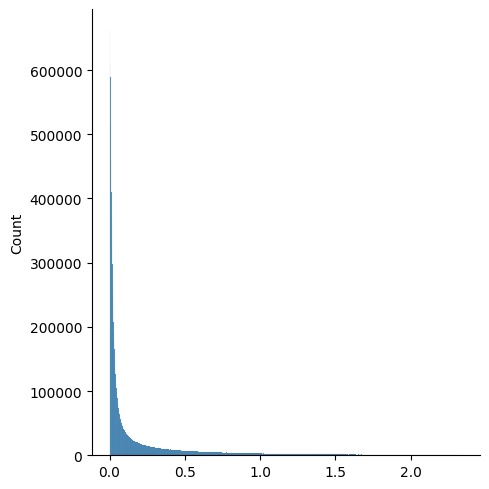
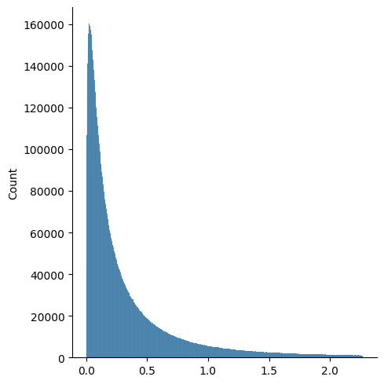
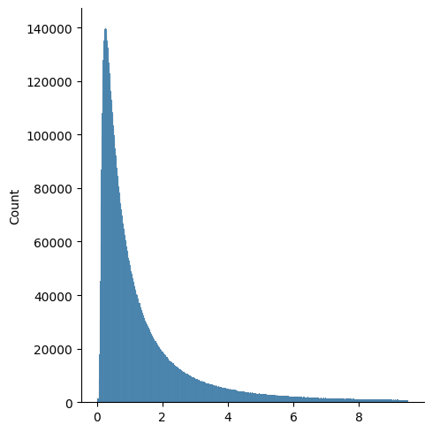
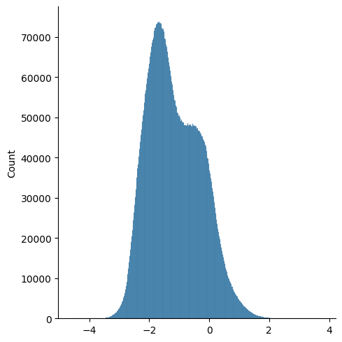
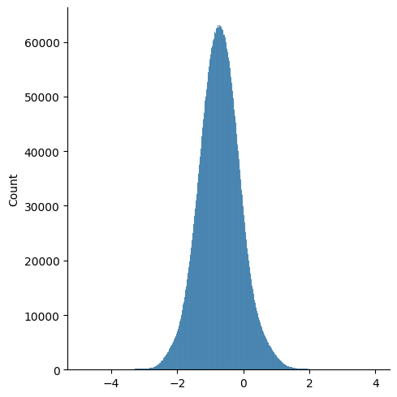
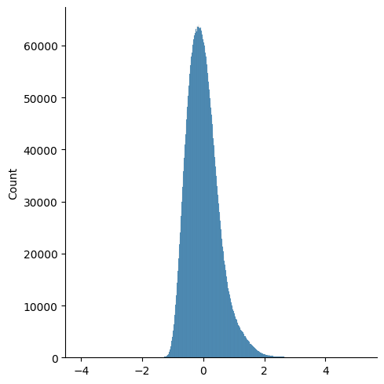

<h1 style="text-align: center;">From Signals To SPD Matrices To Tokens*</h1>

*Work in progress.*

This file regroups explanations for all steps of the transformation of our data, up to the first learned model
component.
This touches upon multiple different modules within this repository, notably those found within the `_3_2_data_modules`
[directory](../../_3_data_management/_3_2_data_modules) in the [SPD processing](#dataset_processing) section
below.  
The main presentation of these components can be found in [the next documentation file](./3%20-%20Formatting%20The%20Model%20Inputs.md).

**Important**: this repository generates many `.pkl` files, all composed of nested lists and dictionaries, making them
difficult to manually inspect. To remedy this, we have included  the `nested_dicts_and_lists_exploration.py`
[standalone Python script](../standalone_tests/nested_dicts_and_lists_exploration.py), which pretty-prints the storage
architecture of the considered files.

<h2 style="text-align: center;">Dataset Extraction</h2>

This project was thought out to be dataset agnostic. Given an original dataset's files being copied into the
`_2_1_original_datasets` [folder](../../_2_data_preprocessing/_2_1_original_datasets), the corresponding
[extraction script](../../_2_data_preprocessing/_2_2_data_extraction/_extraction_scripts) should generate a
"standardized" set of `.pkl` files in a dedicated folder within the `2_2_data_extraction`
[directory](../../_2_data_preprocessing/_2_2_data_extraction), each corresponding to a single recording.  
The expected structure of such a file is available [here](./extras/MASS_SS3_extracted%20-%20pretty-print%20of%20the%20structure%20of%20the%20recording%200001%20pkl%20file.txt),
obtained by applying the `nested_dicts_and_lists_exploration.py` script (above) on the `MASS_SS3_extracted/0001.pkl`
[generated file](../../_2_data_preprocessing/_2_2_data_extraction/MASS_SS3_extracted/0001.pkl).

The `.saved_keys.txt` [file](../../_2_data_preprocessing/_2_2_data_extraction/MASS_SS3_extracted/.saved_keys.txt) will
also be generated, containing the keys common to every `.pkl` file in the extracted dataset folder. It is not used
elsewhere in the project.

If converted to this general structure, any dataset may be utilized with this project. In particular, any MASS subset
should be convertible by creating the appropriate [configuration file](../../_1_configs/_1_z_miscellaneous/dataset_extraction),
with minimal modifications to the 
[extraction script](../../_2_data_preprocessing/_2_2_data_extraction/_extraction_scripts/MASS_extraction.py).

<h2 style="text-align: center;">Preprocessors And Data Readers</h2>

The `Preprocessor` [classes](../../_2_data_preprocessing/_2_3_preprocessors) are designed to apply a number of
transformations onto the raw data, and to save all epoch-wise data in separate `.pkl` files in a directory within the
generated `_2_4_preprocessed_data` [directory](../../_2_data_preprocessing/_2_4_preprocessed_data).  
To allow for more flexibility, a `Preprocessor` class might be configured to generate multiple versions of the
preprocessed data, allowing for the selection of the wanted version through hyperparameters during execution. The
`DataReader` [classes](../../_3_data_management/_3_1_data_readers) perform this task, navigating the nested lists and
dictionaries to obtain the wanted data.

For preprocessing EEG signals into covariance matrices, the `SPDFromEEGPreprocessor`
[class](../../_2_data_preprocessing/_2_3_preprocessors/SPD_matrices_from_EEG_signals/SPDFromEEGPreprocessor.py)
is used, along with its corresponding `SPDFromEEGDataReader`
[class](../../_3_data_management/_3_1_data_readers/SPD_matrices_from_EEG_signals/SPDFromEEGDataReader.py).
The arguments used to instantiate the `SPDFromEEGPreprocessor` class are detailed within the
`parse_initialization_arguments` method, located
[here](../../_2_data_preprocessing/_2_3_preprocessors/SPD_matrices_from_EEG_signals/SPDFromEEGPreprocessor.py).

The data structure within the generated `.pkl` being somewhat complex, it is advised that you generate them and analyze
them through the `nested_dicts_and_lists_exploration.py` script (above) before modifying or creating a `Preprocessor`
and/or `DataReader` class.

<h2 id="preprocessing" style="text-align: center;">Preprocessing Pipeline*</h2>

The `SPDFromEEGPreprocessor` class first applies transformations to the original extracted signals. It then subdivides
them into epoch subwindows, and computes covariance matrices (and potentially statistic vectors, for augmentation
purposes - see [here](#augmentation)) for each subwindow.
Finally, it may also compute recording-wise matrices (and vectors) for whitening purposes (see 
[here](#whitening)).

It is designed to potentially compute and save multiple configurations in `.pkl` files (see ), so that the wanted configuration may be
requested on-the-fly during hyperparameter researches.
In this section, "default" configuration refers to the one applied to the data used to validate our model in the paper.  
By default, we subdivide each epoch into 30 1s subwindows, computing 30 SPD matrices per epoch channel.
As we use 8 EEG signals, our covariance matrices are of size 8 $\times$ 8.

Signal preprocessing pipeline:
- Z-score normalization (optional).
  - Default: applied.
- Channel-wise transformations (optional) - so far, only bandpass filtering with a 4th order Butterworth filter is
implemented.
  - Default: one channel unfiltered, 6 filtered: bands $\delta$ (0.5 to 4 Hz), $\theta$ (4 to 8 Hz),
  $\alpha$ (8 to 13 Hz), low $\beta$ (13 to 22 Hz), high $\beta$ (22 to 30 Hz) and $\gamma$ (30 to 45 Hz).

Epoch-wise preprocessing pipeline (as applied to each epoch subwindow):
- Covariance matrix estimation (multiple methods).
  - Default: standard estimator, through the `numpy.cov` function.
- Computation of statistic vectors (optional) - the vector containing a statistic computed for each signal individually
for the length of the subwindow, used for matrix augmentation.
  - Default: the average Power Spectral Density over the 1s subwindow (proportional to the signal variance found in
  the matrix diagonal, but empirically gives us the best results).

Recording-wise preprocessing pipeline (as applied to each full recording, i.e. each subject for MASS-SS3):
- Recording-wise matrix computation, for each channel (optional) - necessary for whitening.
  - Recording-wise covariance matrix: covariance matrix estimated over the entire recording (optional) - equivalent to
  the Euclidean mean of the corresponding subwindow-derived matrices.
  - Affine invariant estimated mean of the corresponding subwindow-derived matrices (optional) - through the
  `pyriemann.utils.mean.mean_riemann` function.
  - Default: the affine invariant estimated mean, yielding better performance.
- Computation of recording-wise statistic vectors (if applying both augmentation and whitening) - Euclidean mean of the
subwindow-derived statistic vectors.
  - Default: average of average PSDs.
- Computation of variance-only versions of the above recording-wise matrices (optional) - to study the importance of 
the covariance information, cf. our previous work.
  - Default: unused in the latest version of the model.

*Note: we verify during preprocessing that all considered matrices are indeed properly SPD, and not just Positive
Semi-Definite.*

<h2 id="dataset_processing" style="text-align: center;">On-The-Fly SPD Matrix Processing*</h2>

As stated in the beginning of this file, this section refers to the logic encoded within the `_3_2_data_modules`
[directory](../../_3_data_management/_3_2_data_modules).  
These operations were done within the model itself, but the corresponding PyTorch NN
[layers](../../_3_data_management/_3_2_data_modules/SPD_matrices_from_EEG_signals/layers) have been shifted to the data
management portion of the architecture, running only during the network initialization.  
As said layers don't currently contain trainable network parameters, this doesn't cause issue.
The implementation of this processing is further documented [here](./3%20-%20Formatting%20The%20Model%20Inputs.md#tmp_storage).

In this section, we call $SPD(n)$ the set of $n \times n$ SPD matrices.

<h3 id="spd_processing" style="text-align: center;">SPD-To-SPD Processing*</h3>

Both the following operations are optional.  
As seen in [the Preprocessing Pipeline section above](#preprocessing), by
default, both are applied sequentially to our 1s subwindow-derived matrices, with:
- the PSD vector as the augmentation matrix $V$ ($k$ = 1),
- the recording-wise Affine invariant mean matrix as whitening matrix.

<h4 id="augmentation" style="text-align: center;">SPD Matrix Augmentation*</h4>

Given a covariance matrix $C \in SPD(n)$ and any matrix $V_{\alpha} \in \mathbb{R}^{n \times k}$, $k \geq 1$, we can
compute the corresponding augmented matrix $A$:

$$
A = \left(\begin{array}{c|c}
    \\
    C+V_{\alpha} \cdot V_{\alpha}^T&V_{\alpha}\\
    \\
    \hline
    V_{\alpha}^T&I_k\\
    \end{array}\right)
\in SPD(n+k)
$$

The proof of the augmented matrix's positive-definiteness can be found [here](./extras/Proof%20of%20Post-Augmentation%20Positive-Definiteness.pdf).

In our work, we set $V_{\alpha} = V \times \alpha$, with $\alpha \in \mathbb{R}$ being the augmentation factor
controlling for the prominence of a given augmentation matrix $V$ within our augmented matrix.  
This augmentation factor is a model hyperparameter (cf. [here](./3%20-%20Formatting%20The%20Model%20Inputs.md)).

*Note: although we only use a single vector as statistic matrix, you can parameterize the code to build an augmentation
matrix out of multiple concatenated statistic vectors.*

<h4 id="whitening" style="text-align: center;">SPD Matrix Whitening*</h4>

Given $M, G \in SPD(m)$, with $M$ a subwindow-derived matrix and $G$ the corresponding recording-wise matrix encoding
said recording's specificities, we remove these specificities from $M$ using the following whitening operation (cf.
[Barachant et al.](https://doi.org/10.1016/j.neucom.2012.12.039)):  
$$M' = G^{-1/2} M G^{-1/2}$$  
with $M' \in SPD(m)$.

If the subwindow-derived matrices have been augmented with one or more statistic vectors, we augment the recording-wise
matrices with their corresponding recording-wise mean statistic vectors.

<h3 id="tokenization" style="text-align: center;">Tokenization*</h3>

As stated in the paper, one can bijectively map an SPD matrix onto the corresponding vector space of symmetric matrices,
by using the logarithmic map $log_{mat}(\cdot)$.  
This mapping onto the manifold's tangent space is used to define the so-called LogEuclidean metrics:  
$$\delta\_\*^P(A, B) =  \lVert log(P^{-1/2}AP^{-1/2}) - log(P^{-1/2}BP^{-1/2}) \rVert\_\*$$  
with $A, B, P \in SPD(m)$, $P$ the center of projection onto the tangent space, and $\lVert \cdot \rVert\_\*$ a Euclidean
norm on the set of $m \times m$ symmetric matrices $Sym(m)$ (of dimension $d(m) = \frac{m(m+1)}{2}$).

The tokenization process uses this logarithmic map to bijectively represent matrices in $SPD(m)$ as tokens (i.e.
vectors) of $\mathbb{R}^{d(m)}$, with Euclidean operations on the tokens equivalent to LogEuclidean operations on the
matrices (cf. paper).

In the paper, we use $P = \mathbb{I}\_m$, and $\lVert \cdot \rVert\_\* = \lVert \cdot \rVert\_2$ the $\mathcal{L}\_2$ norm
applied to the tokens.  
Note that, assuming the matrices have been [whitened](#whitening), the used LogEuclidean metric is equivalent to having
$P =  G$ as the unwhitened matrices' center of projection.

<h4 id="svd" style="text-align: center;">Matrix Logarithm Implementation & SVD</h4>

Computing the matrix logarithm requires the computation of the eigenvectors and eigenvalues of our matrices.
To ensure stability, as matrix augmentation might sometimes yield very slightly negative eigenvalues in some cases
due to computational errors.  
In previous iterations, we tried to make the augmentation factor mentioned [above](#augmentation) a hyperparameter,
which required the computation of the SVD's derivative for backpropagation. This operation being unstable, we
implemented a stable approximation of this operation using Taylor series. Despite that, the augmentation factor did
not significantly deviate from its initialization value, prompting us to abandon this approach.  

The custom backpropagation is still implemented in the `[ROOT]/_4_models/utils.py`
[Python file](../../_4_models/utils.py).

<h4 id="cutoff" style="text-align: center;">SVD Thresholding*</h4>

Lhe logarithmic mapping is applied to our matrices by diagonalizing the matrix, taking its eigenvalues' logarithm, and
recomposing a matrix by way of the eigenvectors.
By the nature of this operation, any eigenvalue that is very close to 0 would be overblown by this operation. Hence,
if a covariance matrix at a given time for a given channel would've been Symmetric Positive Semi-Definite if not for
some random noise, the eigenvalue(s) associated with this noise would see their relative importance greatly increased
post-mapping.

To study this phenomenon, the `get_distribution_of_eigenvalues.py`
[standalone Python script](../standalone_tests/get_distribution_of_eigenvalues.py) can be used to generate a
histogram-based visualization of the distribution of our matrices' eigenvalues.

Here's an example of the results, for the standard covariance estimator and matrices built from un-filtered,
z-scored-normalized signals, and in different states of whitening:

 |  | 
:------------------------------------------------------------------------------------------------------------------------------------------------------------:|:------------------------------------------------------------------------------------------------------------------------------------------------------------------------------------------------------------------------------:|:-----------------------------------------------------------------------------------------------------------------------------------------------------------------------------------------------------------------------------------:
 No whitening                                                                                                                                                 | Whitening through recording-wise covariance matrices                                                                                                                                                                           | Whitening through the affine invariant mean of the recording's matrices

The area under the curve for a given interval on the horizontal axis corresponds to the proportion of the dataset's matrix
eigenvalues found within said interval.  
For the sake of legibility, only the lower 95% of eigenvalues are displayed here.

In order to better understand what is happening, here is the same data, after taking the eigenvalues' base 10 logarithm
(with 100% of them represented, this time):

 |  | 
:-----------------------------------------------------------------------------------------------------------------------------------------------------------------------:|:-----------------------------------------------------------------------------------------------------------------------------------------------------------------------------------------------------------------------------------------:|:----------------------------------------------------------------------------------------------------------------------------------------------------------------------------------------------------------------------------------------------:
 No whitening                                                                                                                                                            | Whitening through recording-wise covariance matrices                                                                                                                                                                                      | Whitening through the affine invariant mean of the recording's matrices

While a deep analysis of the curves' shape is out of the scope of the present repository, note that for our default
whitening methodology (the column on the right), we observe that while the vast majority of eigenvalues are greater than
$10^{-1}$ (or -1 in log scale), eigenvalues exist with their value lower than $10^{-4}$ (or -4 in log scale).

As such, we have added a thresholding option to our logarithmic mapping, setting all eigenvalues smaller than a chosen
cutoff value $\epsilon$ to the value $\epsilon$.  
In parallel, we have introduced a matrix multiplicative factor $\beta$, which can be applied to all matrices
post-whitening, essentially shifting the logarithmic curves above to the right and lessening the influence of
non-thresholded but small eigenvalues.

The cutoff value $\epsilon$ and the matrix multiplicative factor $\beta$ are both network hyperparameters
(cf. [here](./3%20-%20Formatting%20The%20Model%20Inputs.md)).  
More eigenvalue distribution curves can be found [here](./extras/distribution_of_eigenvectors_in_MASS_SS3_covariance_matrices).
