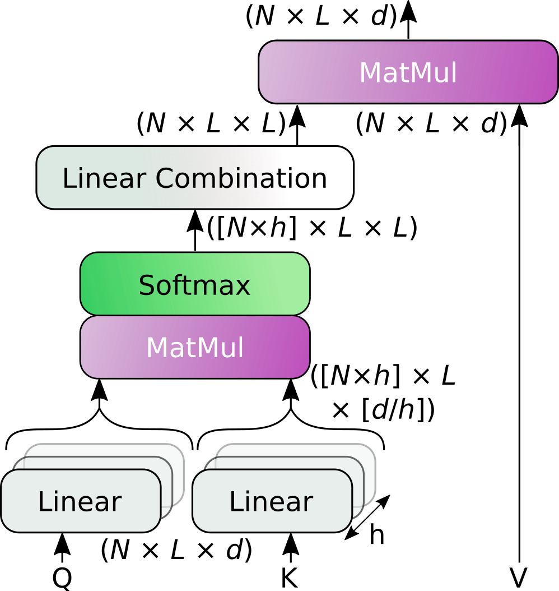

<h1 style="text-align: center;">The SPDTransNet Model*</h1>

*Work in progress. This documentation should be completed by the end of the week (sorry for the delay). In the meantime,
do not hesitate to [contact us](mailto:mathieu.seraphim@unicaen.fr) for more information.*

This repository's iteration of the SPDTransNet model is implemented by the
`VectorizedSPDFromEEGSuccessiveChannelsTransformerModel` [class](../../_4_models/_4_1_sequence_based_models/VectorizedSPDFromEEGSuccessiveChannelsTransformerModel.py),
within the `_4_1_sequence_based_models` [directory](../../_4_models/_4_1_sequence_based_models).  
This directory is composed of four sub-directories, each defining the model's four component blocks:
- [The data formatting block](../../_4_models/_4_1_sequence_based_models/data_formatting_block), preparing the data for
analysis;
- [The intra-element block](../../_4_models/_4_1_sequence_based_models/intra_element_block), computing features for each
element of the input sequence (i.e. each epoch);
- [The inter-element block](../../_4_models/_4_1_sequence_based_models/inter_element_block), comparing said features;
- [The classification block](../../_4_models/_4_1_sequence_based_models/classification_block), processing the last
layer's output and providing the final classification vector.

The main model class chains these blocks together, and manages the training and classification logic, including the loss
function and optimizer.

The arguments used to instantiate the model and its component blocks are detailed within
[the main model class' constructor](../../_4_models/_4_1_sequence_based_models/VectorizedSPDFromEEGSuccessiveChannelsTransformerModel.py).

<h2 style="text-align: center;">Data Formatting</h2>

As the whitening and augmentation operations are handled by the `Dataset` class in this repository's implementation
(see [here](./2%20-%20From%20Signals%20To%20SPD%20Matrices%20To%20Tokens.md#dataset_processing)), the only duty of the
utilized `VectorizedSPDFromEEGDataMultichannelSuccessionReformattingBlock`
[class](../../_4_models/_4_1_sequence_based_models/data_formatting_block/SPD_from_EEG_data_reformatting/VectorizedSPDFromEEGDataMultichannelSuccessionReformattingBlock.py)
is the combination of the different channels into a single sequence, as explained in the paper (Section 3.2).

<h2 style="text-align: center;">Intra- and Inter-Element Autoattention*</h2>

Both intra- and inter-element blocks are based on Transformer encoders, preceded by positional encoding.

The intra-element (i.e. intra-epoch) block also contains an average pooling layer, subdividing the intra-epoch Transformer
encoder's output sequence (of length $S$) into $t$ groups of $\frac{S}{t}$ tokens, and averaging each group.  
This results in $t$ feature tokens per epochs (see the paper for more details).

<h3 style="text-align: center;">Structure-Preserving Multihead Attention</h3>

As alluded to in [the main README file](../../README.md#SPMHA), our Transformer encoders use the standard Pytorch
implementation of said encoders, but with the multihead attention replaced with
[our own SP-MHA](../../_4_models/_4_1_sequence_based_models/intra_element_block/Transformer_based_feature_extraction/layers/StructurePreservingMultiheadAttention.py):

<h3 style="text-align: center;">Learned Sinusoidal Positional Encoding*</h3>

<h2 style="text-align: center;">Obtaining the Classification Vector*</h2>

<h2 style="text-align: center;">Loss and Optimization*</h2>